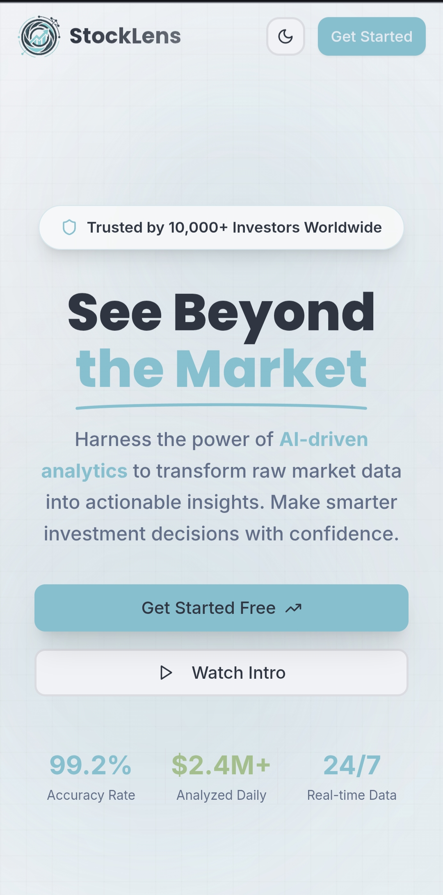
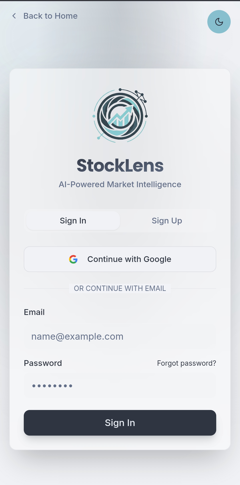
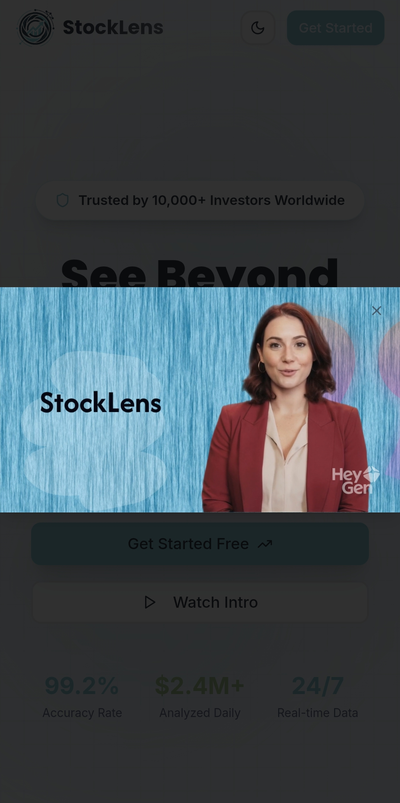

<h1 align="center">
    
</h1>

<h1 align="center">
  <a href="#"> StockLens – AI-Powered Stock Market Analysis and Investment Advisor </a>
</h1>

<h3 align="center">A stock prediction web app built with React and AI integration</h3>

<p align="center">

  
  
  <a href="https://github.com/Momin-786/stocklens-ai-vision-main">
    
  </a>
    
  

  <a href="https://github.com/Momin-786">
    
  </a>
</p>

<h4 align="center"> 
	 Status: In Progress
</h4>

<p align="center">
 <a href="#about">About</a> •
 <a href="#screenshots">Screenshots</a> •
 <a href="#features">Features</a> •
 <a href="#how-it-works">How it works</a> • 
 <a href="#tech-stack">Tech Stack</a> •  
 <a href="#author">Author</a> • 
 <a href="#license">License</a>
</p>

---

## 🧠 About

**StockLens** is a web based project that helps users analyze and understand the stock market through a **simple, interactive, and visually guided interface**.  
It combines **AI-powered analysis**, **real-time stock data**, and **HCI design principles** to provide users with predictions for **buying, holding, or selling** stocks.

This application is **not for real trading**, but rather a **mock analytical platform** for educational and decision-support purposes.

🔗 **Live Demo:** [https://stocklens-ai-vision.netlify.app/](https://stocklens-ai-vision.netlify.app/)

---

## 📸 Screenshots

<p align="center">
  
  <br>
  <em>Main Interactive Dashboard showcasing market overview and trending stocks</em>
</p>

<br>

<p align="center">
  
  
</p>
<p align="center">
  <em>Left: AI Insights & Recommendation Engine | Right: Interactive Stock Charts</em>
</p>

---

## 🚀 Features

- [x] **Interactive Dashboard** displaying top and trending stocks  
- [x] **Search & Filter** functionality by name, category, and time period  
- [x] **AI-Powered Predictions** (Buy / Hold / Sell suggestions)  
- [x] **Graphical Visualization** of live stock data  
- [x] **User-Friendly Interface** following HCI usability rules  
- [x] **Responsive Design** suitable for desktop and mobile users  

---

## ⚙️ How it works

The project focuses on front-end interaction and design usability.  
Users can view, analyze, and receive AI insights on selected stocks in real-time.

### Pre-requisites

Before you begin, make sure you have the following installed:
- [Git](https://git-scm.com/)
- [Node.js](https://nodejs.org/en/)
- Code editor like [VS Code](https://code.visualstudio.com/)

#### Running the Web Application (Frontend)

```bash
# Clone this repository
$ git clone [https://github.com/Momin-786/stocklens-ai-vision-main.git](https://github.com/Momin-786/stocklens-ai-vision-main.git)

# Access the project folder
$ cd stocklens-ai-vision-main

# Install dependencies
$ npm install

# Set up environment variables
$ cp .env.example .env.local

# Run the app
$ npm run dev

```
#### Environment Variables
Create a .env.local file in the root directory with:
```env
VITE_SUPABASE_URL=[https://your-project.supabase.co](https://your-project.supabase.co)
VITE_SUPABASE_PUBLISHABLE_KEY=your-anon-key-here
VITE_SITE_URL=http://localhost:8080

```
#### Deploying to Netlify
See NETLIFY_DEPLOYMENT.md for a complete step-by-step deployment guide, including:
 * How to create and connect your Netlify site
 * Required environment variables and where to find them
 * Supabase configuration for Netlify
 * Troubleshooting common issues
## 💻 Tech Stack
**Platform:** React.js + TypeScript
#### **Libraries & Tools**
 * **React Router Dom** – Navigation
 * **Axios** – API communication
 * **Chart.js / Recharts** – Graph visualizations
 * **Tailwind CSS** – Styling
 * **Framer Motion** – Animations
 * **Lucide Icons** – UI Icons
 * **Moment.js** – Date formatting
 * **Netlify** – Deployment
> See dependencies in package.json
> 
## 🧠 HCI Design Principles Applied
 * **Simplicity:** Minimal and clear interface to reduce cognitive load.
 * **Consistency:** Unified color palette and layout hierarchy across views.
 * **Feedback:** Instant visual updates upon filtering or requesting AI predictions.
 * **Accessibility:** High-contrast elements, clear labels, and responsive scaling.
 * **Color Scheme:**
   * Primary: Blue (#2563EB) – trust and professionalism
   * Secondary: Green (#10B981) – growth and positivity
   * Background: Light gray/white for clarity
## 👥 Author
<a href="https://github.com/Momin-786">

<br />
<p><b>Abdul Momin</b></p>
</a>

**Team Member:**  
👨‍💻 **Mutyyab** – Developer & Analyst

---

## 📜 License

This project is licensed under the **MIT License**.  
See the file [LICENSE](./LICENSE) for details.

---

## 📘 Learn More

This project was created with [Create React App](https://github.com/facebook/create-react-app).  
To learn React, visit the [React documentation](https://reactjs.org/).
